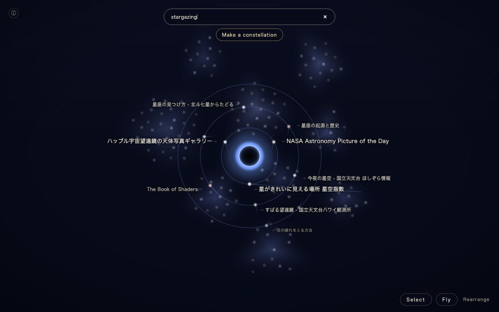
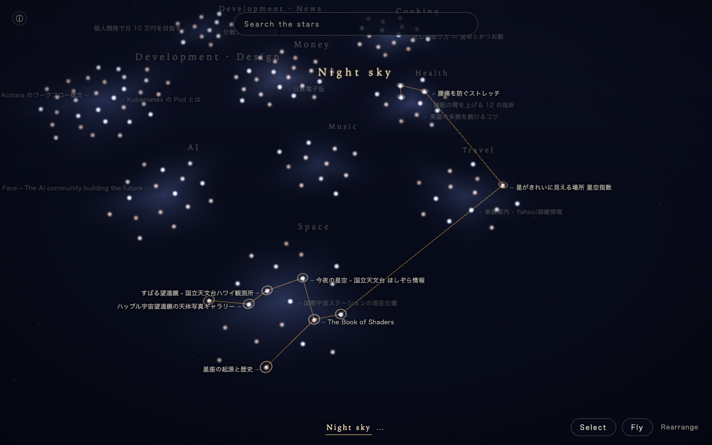
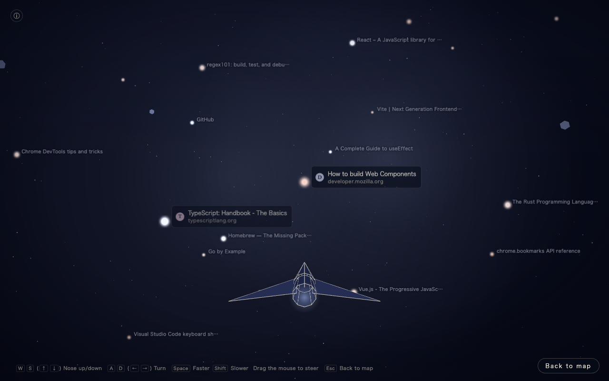

# Bukusupe (Bookmark Space)

**English** | [日本語](README.ja.md)

**Your Chrome bookmarks as stars on a map of the universe, arranged by meaning.** Search pulls matching stars toward a black hole,
and you can link the stars you pick into saved constellations. You can also fly a spaceship among the stars.

"Bukusupe" (ブクスペ) is short for "bookmark space" in Japanese. This project was built at [HACK SONIC 2026 Autumn](https://www.dhw.co.jp/press-release/20260819_hacksonic5/).

> [!NOTE]
> Bukusupe will be published on the Chrome Web Store. Until then, load it in developer mode as described under "Install" below.

**Web demo (sample universe): https://j341nono.github.io/bukusupe/**
(Try it without installing. The demo uses sample bookmarks only; flight mode needs a computer.)

| Search: stars are pulled toward a black hole | Constellations: link the stars you pick | Flight mode: fly among the stars |
|---|---|---|
|  |  |  |

## Install (Chrome extension)

No build step is needed: the repository includes the built `dist/` folder.

1. Get the repository

   ```bash
   git clone https://github.com/j341nono/bukusupe.git
   ```

   Without git, use "Code → Download ZIP" on the GitHub page and unzip it.
2. Open `chrome://extensions` in Chrome
3. Turn on "Developer mode" at the top right
4. Click "Load unpacked" and choose the **`dist`** folder inside the downloaded folder
5. Click the Bukusupe icon in the toolbar (it may be inside the puzzle-piece menu) to open the star map in its own tab

The first time, Bukusupe shows a short explanation. When you press "Start", it downloads the model data (about 135 MB) and computes the meaning of your
bookmarks. This takes from tens of seconds to a few minutes (after that, it opens right away).
If you have only a few bookmarks, you can switch to "Try the sample universe" from ⓘ at the top left ("Back to my bookmarks" brings you back anytime).

**Language**: the interface is available in English and Japanese. It follows your browser's language by default (Japanese if your browser is in Japanese,
English otherwise). You can change it anytime with "Language" at the bottom of the ⓘ panel or at the top right of the first-run screen; it switches
immediately and is remembered. The model is multilingual, so you can search in either language.

## How to use

- **Map**: bookmarks about similar things gather into clusters. A star's brightness and color show when you last touched it (recent ones are brighter and bluer).
  Drag to move and scroll to zoom. Click a cluster name to fly to it.
- **Search**: type in the search box at the top, and matching stars are pulled into orbit around a black hole (they are found by meaning, even when the words don't match).
  Press `Enter` to open the page in the same tab, and use the browser's Back button to return to Bukusupe where you left off.
- **Constellations**: press the "Select" button at the bottom right or `C` to enter **selection mode**, then click stars anywhere on the map to pick them (click again to unpick).
  Hold `Shift` and drag to pick all stars inside a rectangle. Picked stars get a gold ring and stay picked while you move, zoom, or search.
  Use "New constellation" at the bottom to name and save them, or "Add to a constellation" / "Remove from constellation" to edit an existing one (your bookmarks themselves are never deleted).
  While searching, "Make a constellation" (or `Shift`+`Enter`) enters selection mode with the top results already picked; "Select all results" is also available.
  Click a name at the bottom of the screen to recall that constellation. A constellation keeps exactly the stars you saved.
  When a bookmark added after saving matches its search words, it is shown as a "nova", which you can "Add" or "Skip".
- **Flight mode**: enter with the "Fly" button or `F`, and press `Esc` to return to the map. The spaceship keeps moving forward; steer with `W` `A` `S` `D` (or the arrow keys),
  press `Space` to speed up and `Shift` to slow down. Near a star you see its name; fly into its core to open the page.

### Keys

| Map | |
|---|---|
| `W` `A` `S` `D`, left-drag | Move |
| `Space` / `Shift` (or scroll) | Zoom out / zoom in (`Shift` doesn't zoom in selection mode) |
| Right-drag up/down | Tilt |
| `/` | Go to the search box |
| `↑` `↓` | Pick a search result |
| `Enter` | Open in the same tab (`Ctrl`/`⌘`+`Enter` for a new tab) |
| `Shift`+`Enter` | Enter selection mode with the search results picked |
| `C` | Enter / leave selection mode |
| Click a star (selection mode) | Pick / unpick |
| `Shift`+drag (selection mode) | Pick all stars in a rectangle |
| `Esc` | Leave selection mode, clear the search, or deselect the constellation |
| Click / double-click a star | Show its card / open it |

| Flight mode | |
|---|---|
| `F` / `Esc` | Enter / back to the map |
| (no input) | The ship keeps moving forward |
| `W` / `S` (`↑` / `↓`) | Nose up / down (hold for a loop) |
| `A` / `D` (`←` / `→`) | Turn left / right |
| `Space` / `Shift` (while held) | Speed up / slow down (never stops) |
| Mouse drag | Steer (only while the button is held) |
| Fly into a star's core | Open that page (hold `Ctrl`/`⌘` for a new tab) |

## About the install warnings

When you load the extension, Chrome shows these permissions:

- **Read and change your bookmarks**: needed to read your bookmarks and show them as stars. **Bukusupe only reads them and never changes or deletes them**
  (Chrome's permission message groups "read and change" together).
- **Read the icons of the websites you visit**: used to show site icons that Chrome already has, in flight mode. Bukusupe never fetches icons from the network.

After you read the first-run explanation and press "Start", Bukusupe downloads the model data used to compute meaning (about 135 MB) from Hugging Face.
The model version is pinned, and every file is checked against a SHA-256 hash when downloaded and when loaded from the cache. Hugging Face allows downloads
from other sites, so Bukusupe does not ask for any website access permission for this. **Your bookmarks are never sent.** The downloaded model runs only inside your browser.

## Privacy

Privacy policy: https://j341nono.github.io/bukusupe/privacy/ (English and Japanese)

- Your bookmarks (title, URL, folder names, date added, date last used) and constellations are **handled only inside your browser and never sent out**.
  Computing meanings, laying out the map, searching, and saving constellations all happen inside your browser (IndexedDB and so on).
- The only network access is **the one-time download of the model weights** (from Hugging Face's `huggingface.co` and `*.hf.co`; it only downloads and
  contains none of your bookmarks. Afterwards the browser cache is used).
- No analytics, no ads, and nothing is shared with third parties. All program code (scripts and WebAssembly) is bundled; nothing is loaded from outside.
- Removing the extension deletes everything Bukusupe has stored.

## Known limitations

- Site icons appear only for pages you have opened in Chrome (otherwise a crest with the domain's initial is shown).
- The first run takes time to download the model and compute meanings (from tens of seconds to a few minutes, depending on your bookmarks and connection).
- The web demo uses sample bookmarks only. Flight mode needs a computer (keyboard and mouse); on phones you can use the map and search.
- In the web demo, search matches only words until the model has finished loading in the background.
- The sample universe's bookmarks are in Japanese for now (an English sample is in preparation).

## Development

```bash
npm install
npm run dev              # http://localhost:5173 (sample data)
npm run build            # build for distribution into dist/ (rebuild after changing the source and commit dist/ too)
npm run build:debug      # build for checks into dist-debug/ (includes the ?debug=1 hooks and measurements used by the automated checks)
npm run build:web        # build the web demo into dist-web/
npm run package          # create the store zip in release/ (fails if the version numbers or the contact address don't match)
npm run check:ext        # automated checks (dist/ matches the source, the distribution build, first run, the extension, flight mode, the web demo, languages)
npm run sample:precompute  # rebuild the precomputed sample bundled with the web demo (after changing the sample or the layout)
```

The development documents (`docs/`) are in Japanese. The interface text lives in `src/i18n/en.ts` and `src/i18n/ja.ts`.

## Contact

- Bugs and requests: [GitHub Issues](https://github.com/j341nono/bukusupe/issues)
- Email: j341nono.dev [at] gmail.com

You don't need to include the contents of your bookmarks in a report.

## License

Bukusupe's code is under the [MIT License](LICENSE).

Licenses of the bundled third-party software and model are in [THIRD_PARTY_NOTICES](THIRD_PARTY_NOTICES).
