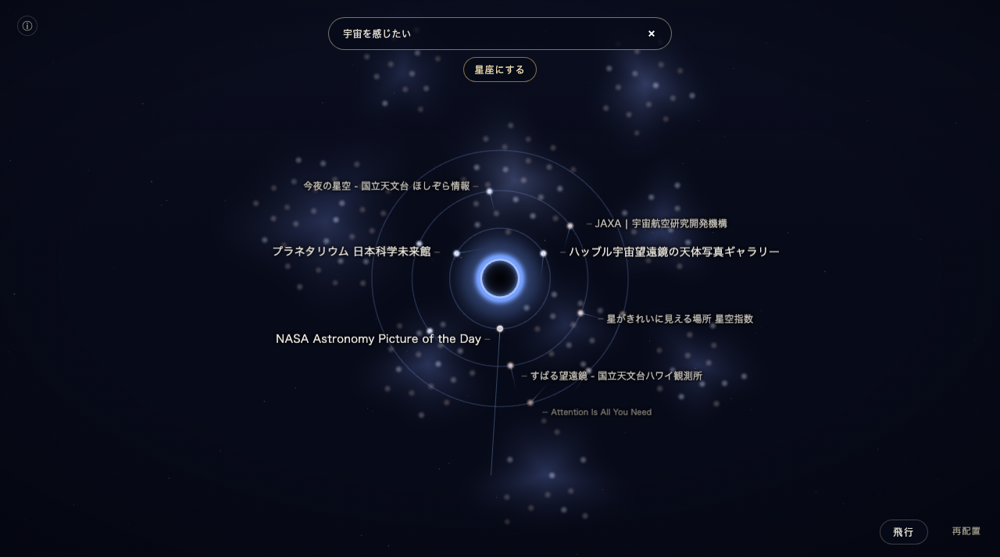
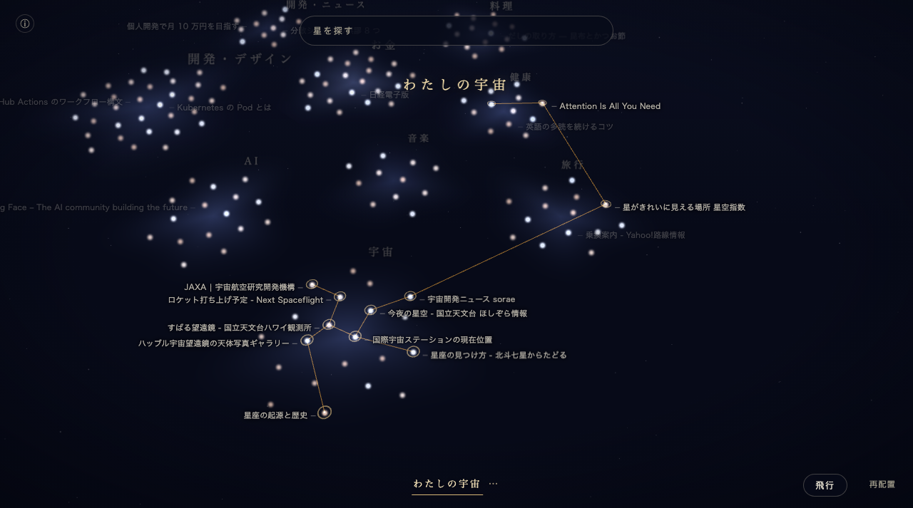
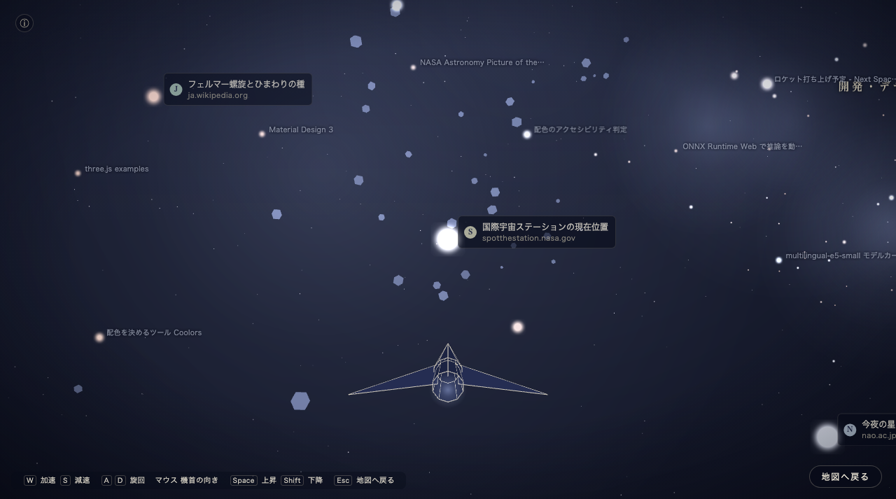

# ブクスペ（Bookmark Space）

**Chrome のブックマークを星にして、意味の近さで並べた宇宙地図。** 検索すると星がブラックホールへ引き寄せられ、
選んだ星を結んで星座として残せます。星の間を宇宙船で飛ぶこともできます。

[HACK SONIC 2026 秋](https://www.dhw.co.jp/press-release/20260819_hacksonic5/) で開発したプロジェクトです。

> [!NOTE]
> 今後、Chrome ウェブストアで公開していく予定です。公開までは、下の「導入」の手順（デベロッパー モードで読み込む）でお使いください。

**Web のデモ（サンプルの宇宙）：https://j341nono.github.io/bukusupe/**
（インストールせずに試せます。ブックマークはサンプルだけ、飛行モードは PC のみ）

| 検索：星がブラックホールへ引き寄せられる | 星座：選んだ星を結んで残す | 飛行モード：星の間を飛ぶ |
|---|---|---|
|  |  |  |

## 導入（Chrome 拡張機能）

ビルドは要りません。リポジトリにビルド済みの `dist/` が入っています。

1. リポジトリを取得する

   ```bash
   git clone https://github.com/j341nono/bukusupe.git
   ```

   git を使わない場合は、GitHub のページの「Code → Download ZIP」で同じものを取得し、展開してください。
2. Chrome で `chrome://extensions` を開く
3. 右上の「デベロッパー モード」を ON にする
4. 「パッケージ化されていない拡張機能を読み込む」を押し、取得したフォルダの中の **`dist`** フォルダを選ぶ
5. ツールバーのブクスペのアイコン（パズルのピースのメニューの中にあります）を押すと、専用のタブが開きます

初回はモデルの重み（約 135 MB）を取得し、ブックマークの意味を計算します。数十秒〜数分かかります（2 回目からはすぐに開きます）。
ブックマークが少ない場合は、左上の ⓘ から「サンプルの宇宙で試す」に切り替えられます（「自分のブックマークに戻る」でいつでも戻れます）。

## 使い方

- **地図**：似た内容のブックマークが近くに集まり、星団になります。星の明るさと色は最後に触れた日（最近ほど明るく青白い）。
  ドラッグで移動、ホイールで拡大縮小。星団名を押すとその星団へ寄ります。
- **検索**：上の検索欄に言葉を入れると、合う星がブラックホールの周りの軌道へ引き寄せられます（言葉が一致しなくても、意味が近ければ見つかります）。
  `Enter` でそのページを同じタブで開き、ブラウザの「戻る」でブクスペの続きに戻れます。
- **星座**：検索して「星座にする」（または `Shift`+`Enter`）→ 星をクリックして加える・外す → 名前を付けて保存。
  画面下の名前を押すと、その星座を呼び出します。星座の星は保存したときのまま変わりません。
  保存の後に加えたブックマークがその検索語に合うときは「新星」として知らせるので、「加える」か「見送る」を選べます。
- **飛行モード**：「飛行」ボタンか `F` で入り、`Esc` で地図に戻ります。星に近づくと名前が見え、星の芯に入るとそのページが開きます。

### キー操作

| 地図 | |
|---|---|
| `W` `A` `S` `D`・左ドラッグ | 移動 |
| `Space` / `Shift`（ホイールでも） | 縮小 / 拡大 |
| 右ドラッグの上下 | 傾き |
| `/` | 検索欄へ |
| `↑` `↓` | 検索の候補を選ぶ |
| `Enter` | 同じタブで開く（`Ctrl`/`⌘`+`Enter` で新しいタブ） |
| `Shift`+`Enter` | 検索結果を星座にする |
| `Esc` | 検索を消す・星座の選択を解く |
| 星をクリック / ダブルクリック | カードを出す / 開く |

| 飛行モード | |
|---|---|
| `F` / `Esc` | 入る / 地図へ戻る |
| `W` / `S` | 加速 / 減速 |
| `A` `D`・マウスの左右 | 旋回 |
| マウスの上下 | 機首の上下 |
| `Space` / `Shift` | 上昇 / 下降 |
| 星の芯に入る | そのページを開く（`Ctrl`/`⌘` を押しながらなら新しいタブ） |

## インストール時の警告について

Chrome は読み込むときに、次の権限を表示します。

- **ブックマークの読み取りと変更**：ブックマークを星として表示するために読み取ります。**読み取るだけで、変更・削除はしません**
  （Chrome の権限の表示が「読み取りと変更」をひとまとめにしているためです）。
- **アクセスしたウェブサイトのアイコンの読み取り**：飛行モードで、Chrome が既に持っているサイトのアイコンを表示するためです。外部には取りに行きません。

初回に、意味の計算に使うモデルの重み（約 135 MB）を Hugging Face から取得します。Hugging Face は他のサイトからの取得を許しているので、
そのための権限（ウェブサイトへのアクセス）は求めません。**ブックマークは送りません。** 取得したモデルはブラウザの中だけで動きます。

## プライバシー

- ブックマークの内容は**ブラウザの外に送りません**。意味の計算・配置・検索・星座の保存は、すべてブラウザの中（IndexedDB）で行います。
- 外部との通信は、**初回のモデルの重みの取得だけ**です（Hugging Face。2 回目以降はブラウザのキャッシュから読みます）。
- 分析やログの送信はしていません。プログラム（スクリプト・WASM）はすべて同梱しており、外部から読み込みません。

## 既知の制限

- サイトのアイコンは、Chrome で開いたことのあるページだけ表示されます（無いときはドメインの頭文字の紋章になります）。
- 初回はモデルの取得と計算に時間がかかります（ブックマークの件数と回線によって数十秒〜数分）。
- Web のデモはサンプルのブックマークだけです。飛行モードは PC（キーボードとマウス）のみで、スマホでは地図と検索を使えます。
- Web のデモでは、モデルを裏で読み込み終えるまで、言葉が一致するものだけを探します。

## 開発

```bash
npm install
npm run dev              # http://localhost:5173（サンプルデータ）
npm run build            # 配布用のビルドを dist/ に作る（ソースを直したら作り直して、dist/ もコミットする）
npm run build:debug      # 確認用のビルドを dist-debug/ に作る（?debug=1 の確認用の窓口・測定用の仕組みを含む。自動確認と測定が使う）
npm run build:web        # Web のデモを dist-web/ に作る
npm run package          # ストアに上げる zip を release/ に作る（版の番号と問い合わせ先がそろっていないと失敗する）
npm run check:ext        # 自動確認（dist/ の一致、配布用のビルドの中身、初回起動、拡張機能、飛行モード、Web のデモ）
npm run sample:precompute  # Web のデモに同梱する計算済みのサンプルを作り直す（サンプルや配置の計算を変えたとき）
```

## ライセンス
ブクスペのコードは [MIT License](LICENSE) です。

同梱している第三者のソフトウェアとモデルのライセンスは [THIRD_PARTY_NOTICES](THIRD_PARTY_NOTICES) にあります。

