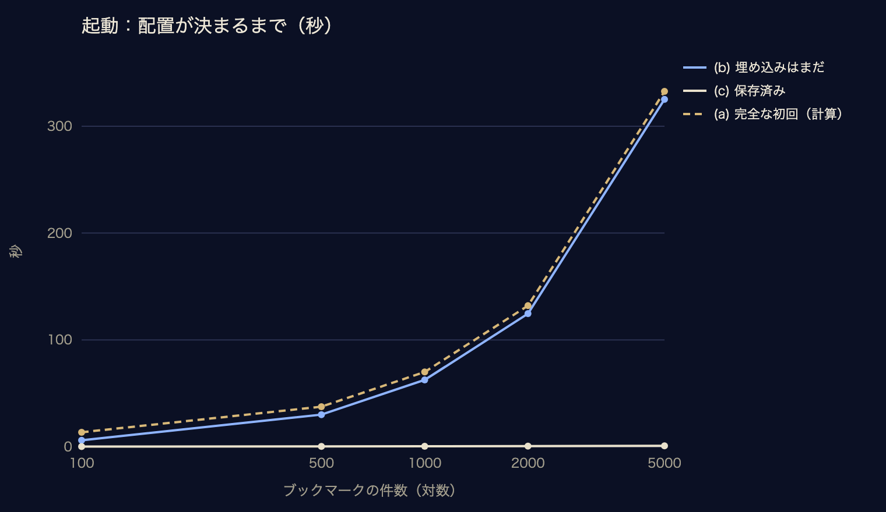
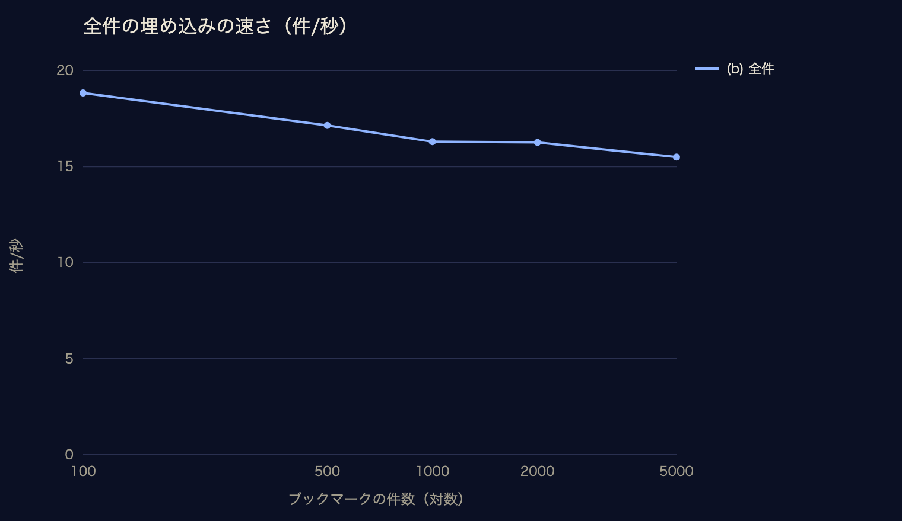
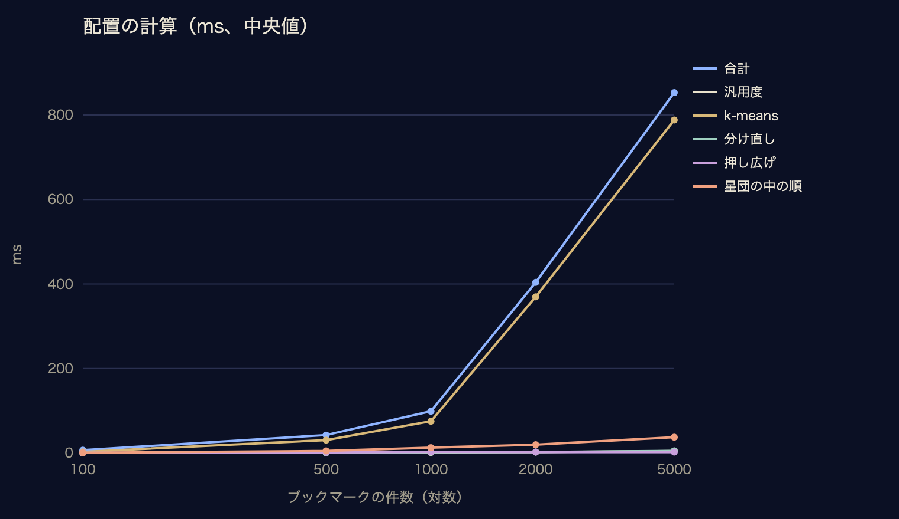
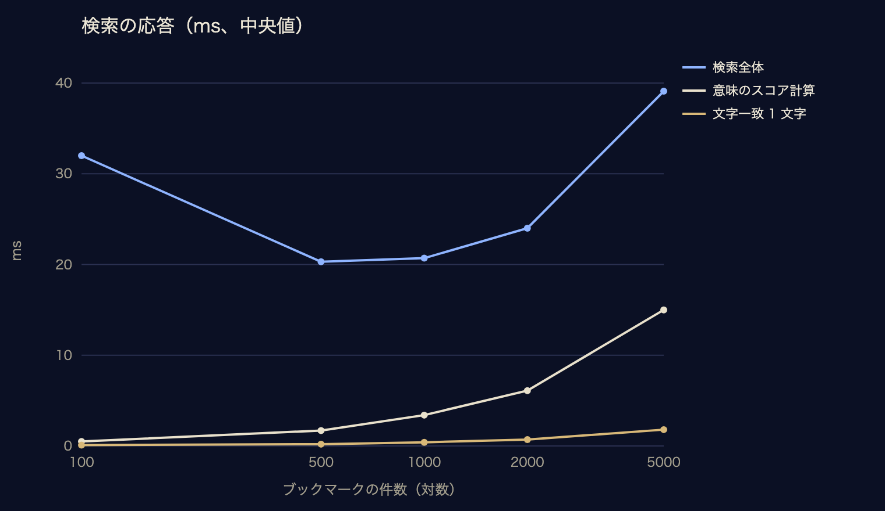
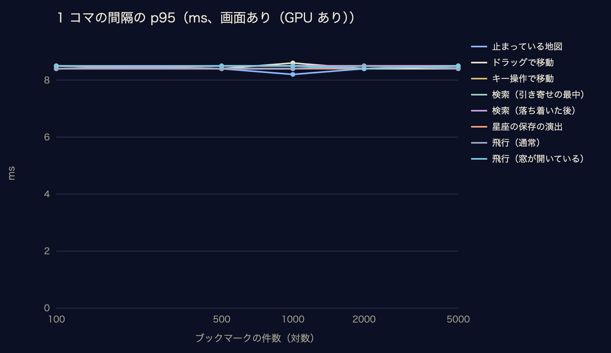
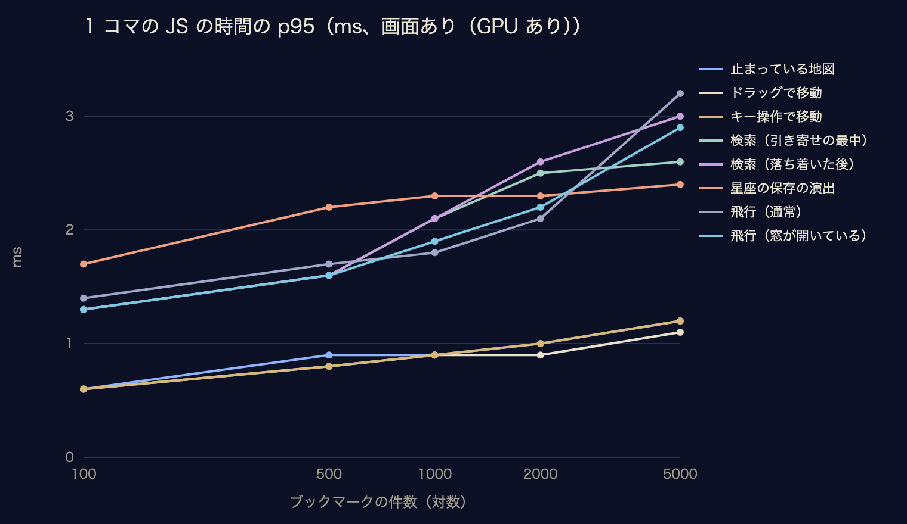
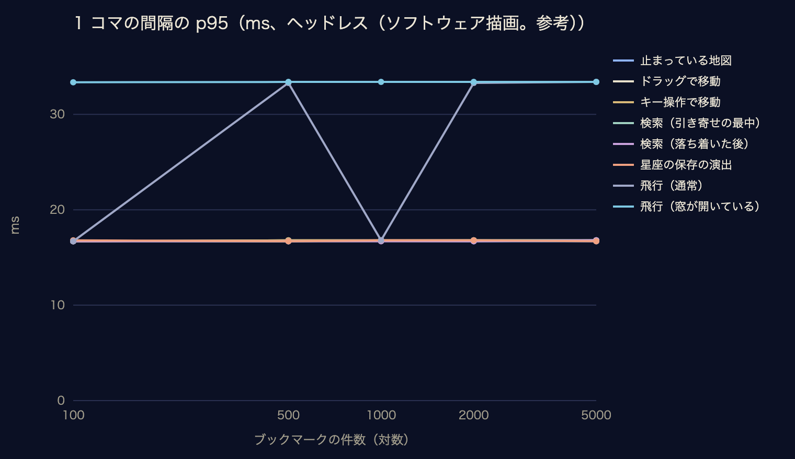
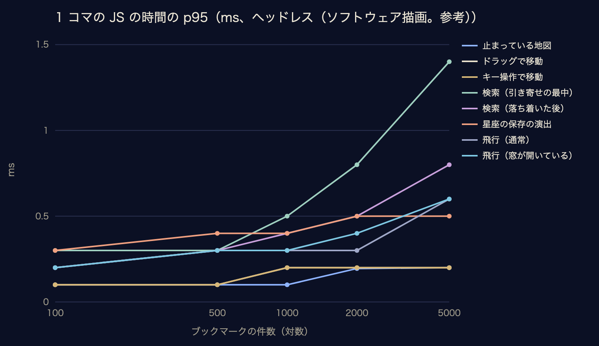
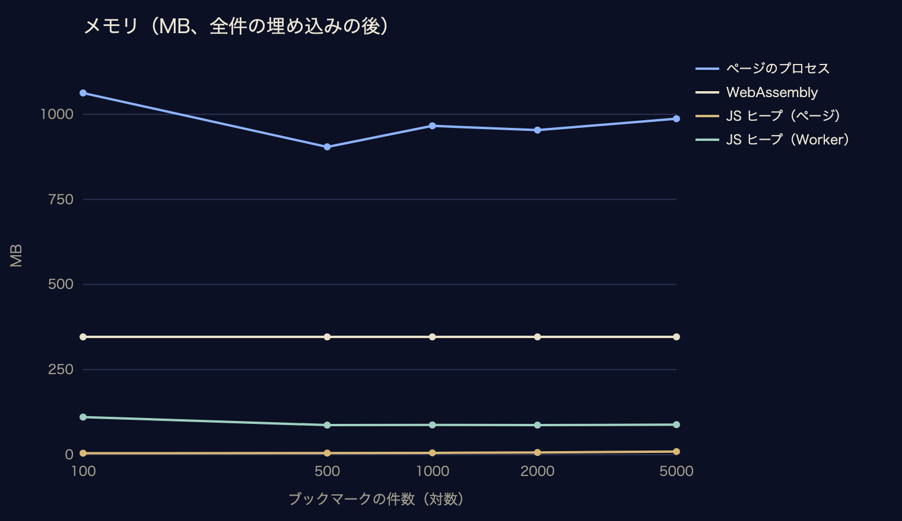

# ブクスペの時間とメモリの測定

> このファイルは `scripts/bench/report.mjs` が `docs/bench/results/` の生の結果（JSON・CSV）から作る。数字を手で直さない。
> 測り直しは `npm run bench`（一部は `npm run bench -- --only=<項目>`）、報告書だけ作り直すのは `npm run bench:report`。

## 要約

| 項目 | 値 | 補足 |
|---|---|---|
| 初めて開いてから星が見えるまで（サンプル 156 件、モデルの取得を含む） | 0.33 秒 | 意味検索が使えるまで 17.0 秒（3 回の中央値） |
| 初回に取得するモデルの容量 | 135.5 MB | 10 Mbps で約 108 秒・100 Mbps で約 11 秒 |
| 2 回目以降の起動（2000 件、すべて保存済み） | 0.69 秒 | 意味検索が使えるまで 0.89 秒 |
| 全件の埋め込み（2000 件、初回だけ） | 123.1 秒 | 1 秒あたり 16.3 件 |
| 検索の応答（2000 件、検索語の埋め込みから星の引き寄せの開始まで） | 24.0 ms | 入力の待ち 300 ms を除く。文字一致の 1 文字は 0.70 ms |
| 飛行中の 1 コマの間隔（2000 件、画面あり） | 中央値 6.90 ms・p95 8.50 ms | 144 コマ/秒。1 コマの JS 0.70 ms |
| 何もしていない地図の CPU 使用率（2000 件、画面あり） | 73.3% | ページ＋GPU のプロセス。描画のループを止めると 0.0% |

## 測定の環境と条件

| 項目 | 値 |
|---|---|
| 機種 | MacBook Pro（Mac14,9） |
| CPU | Apple M2 Pro（10 (6 Performance and 4 Efficiency)） |
| メモリ | 16 GB |
| GPU | Apple M2 Pro（16 コア、Metal 4） |
| 画面（画面ありの描画） | DELL S2725DC、2560 x 1440 @ 144.00Hz（本体の蓋を閉じ、外部ディスプレイだけで表示） |
| OS | macOS 26.5.2 (25F84) |
| Chrome | Google Chrome 153.0.8010.53 |
| Node.js | v22.22.2 |

測定ごとの日時・描画の方法・電源・負荷。「他のアプリの CPU」は、この測定のスクリプトと、それが起動した Chrome を除いたプロセスの CPU 使用率の合計（1 コア＝100%、5 秒ごと。150% を超えたら ⚠。測定の各段の前に超えていたら、下がるまで待ち、下がらなければ測定を止める）。ロードアベレージ（1 分平均）は測定そのもの（埋め込みの計算など）の負荷も含むので参考：

| 結果 | 日時（UTC） | 描画 | 電源 | 他のアプリの CPU（開始時 → 測定中） | ロードアベレージ（開始時 → 最大） |
|---|---|---|---|---|---|
| size | 2026-09-26 20:30 | — | AC Power | 63% → 中央値 —%・最大 63% | 2.13 → 最大 2.13 |
| fresh | 2026-09-26 20:30 | ヘッドレス（ソフトウェア描画） | AC Power | 52% → 中央値 27%・最大 593% ⚠ | 2.13 → 最大 14.48（高め） |
| startup | 2026-09-26 20:34 | ヘッドレス（ソフトウェア描画） | AC Power | 70% → 中央値 13%・最大 263% ⚠ | 12.52 → 最大 13.84（高め） |
| query | 2026-09-26 20:34 | ヘッドレス（ソフトウェア描画） | AC Power | 70% → 中央値 13%・最大 263% ⚠ | 12.52 → 最大 13.84（高め） |
| layout | 2026-09-26 20:34 | ヘッドレス（ソフトウェア描画） | AC Power | 70% → 中央値 13%・最大 263% ⚠ | 12.52 → 最大 13.84（高め） |
| search | 2026-09-26 20:34 | ヘッドレス（ソフトウェア描画） | AC Power | 70% → 中央値 13%・最大 263% ⚠ | 12.52 → 最大 13.84（高め） |
| add | 2026-09-26 20:34 | ヘッドレス（ソフトウェア描画） | AC Power | 70% → 中央値 13%・最大 263% ⚠ | 12.52 → 最大 13.84（高め） |
| memory | 2026-09-26 23:00 | ヘッドレス（ソフトウェア描画） | AC Power | 196% → 中央値 12%・最大 188% ⚠ | 1.58 → 最大 16.15（高め） |
| disk | 2026-09-26 20:34 | ヘッドレス（ソフトウェア描画） | AC Power | 70% → 中央値 13%・最大 263% ⚠ | 12.52 → 最大 13.84（高め） |
| web | 2026-09-26 21:34 | ヘッドレス（ソフトウェア描画） | AC Power | 86% → 中央値 51%・最大 148% | 10.12 → 最大 9.39（高め） |
| quant | 2026-09-26 21:35 | ヘッドレス（ソフトウェア描画） | AC Power | 93% → 中央値 12%・最大 104% | 8.73 → 最大 10.56（高め） |
| render-headful | 2026-09-26 22:27 | 画面あり（ANGLE (Apple, ANGLE Metal Renderer: Apple M2 Pro, Unspecified Version)） | AC Power | 73% → 中央値 69%・最大 174% ⚠ | 2.09 → 最大 3.49 |
| render-headless | 2026-09-26 21:54 | ヘッドレス（ソフトウェア描画） | AC Power | 105% → 中央値 12%・最大 361% ⚠ | 9.37 → 最大 9.58（高め） |
| idle-headful | 2026-09-26 22:27 | 画面あり（ANGLE (Apple, ANGLE Metal Renderer: Apple M2 Pro, Unspecified Version)） | AC Power | 73% → 中央値 69%・最大 174% ⚠ | 2.09 → 最大 3.49 |
| idle-headless | 2026-09-26 21:54 | ヘッドレス（ソフトウェア描画） | AC Power | 105% → 中央値 12%・最大 361% ⚠ | 9.37 → 最大 9.58（高め） |

**条件**

- ブックマークの件数：100・500・1000・2000・5000 件（100 件はサンプルから選び、500 件以上は生成。下の「生成の方法と限界」）。
- 起動の 3 段階：(a) 完全な初回（まっさらなプロファイル。モデルの取得から）、(b) モデルは取得済みで埋め込みはまだ（測定用の DB を消して開く）、(c) すべて保存済み（再読み込み）。
- 繰り返し：各測定は最初の 1 回を捨て、5 回。完全な初回はサンプル 156 件で 3 回（最初の 1 回も捨てない）と、足し算の確認のため 2000 件で 1 回。
- 表の値は **中央値（四分位範囲 q1〜q3）／ p95**。1 コマの時間は、5 回分のすべてのコマをまとめた分布。
- 測定用の仕組みは `?debug=1` のときだけ動く（`src/debug/timing.ts`、`SpaceView.setProfiling` など）。ふだんの動作は変えていない。

**使ったブックマーク**

| 件数 | うち生成 | タイトルの長さ（中央値／p90／最大） | 重複しないタイトル | ドメインの種類 |
|---|---|---|---|---|
| 100 | 0 | 16／30／51 文字 | 100 | 90 |
| 500 | 344 | 20／36／67 文字 | 497 | 136 |
| 1000 | 844 | 21／36／87 文字 | 964 | 136 |
| 2000 | 1844 | 21／37／78 文字 | 1793 | 136 |
| 5000 | 4844 | 22／37／87 文字 | 3755 | 136 |

## 1. 起動

最初に星が見える（仮の配置を含む）・配置が決まる（準備完了）・意味検索が使えるようになる（検索欄の準備とモデルの読み込みの遅いほう）までの時間。ページを開いた時点から。

| 件数 | 段階 | 最初に星が見える | 配置が決まる | 意味検索が使える |
|---|---|---|---|---|
| 100 | (b) 埋め込みはまだ | 0.23 秒（0.22 秒〜0.23 秒）／ p95 0.23 秒 | 6.18 秒（6.16 秒〜6.42 秒）／ p95 6.44 秒 | 6.19 秒（6.16 秒〜6.43 秒）／ p95 6.45 秒 |
| 100 | (c) 保存済み | 0.23 秒（0.23 秒〜0.23 秒）／ p95 0.23 秒 | 0.27 秒（0.27 秒〜0.27 秒）／ p95 0.28 秒 | 0.83 秒（0.83 秒〜0.85 秒）／ p95 0.86 秒 |
| 500 | (b) 埋め込みはまだ | 0.24 秒（0.24 秒〜0.25 秒）／ p95 0.25 秒 | 30.1 秒（29.4 秒〜30.2 秒）／ p95 30.2 秒 | 30.1 秒（29.4 秒〜30.2 秒）／ p95 30.2 秒 |
| 500 | (c) 保存済み | 0.24 秒（0.24 秒〜0.24 秒）／ p95 0.24 秒 | 0.42 秒（0.41 秒〜0.43 秒）／ p95 0.43 秒 | 0.86 秒（0.86 秒〜0.87 秒）／ p95 0.88 秒 |
| 1000 | (b) 埋め込みはまだ | 0.25 秒（0.21 秒〜0.25 秒）／ p95 0.26 秒 | 62.6 秒（61.2 秒〜62.9 秒）／ p95 62.9 秒 | 62.6 秒（61.2 秒〜62.9 秒）／ p95 62.9 秒 |
| 1000 | (c) 保存済み | 0.27 秒（0.26 秒〜0.27 秒）／ p95 0.27 秒 | 0.54 秒（0.54 秒〜0.54 秒）／ p95 0.55 秒 | 0.88 秒（0.88 秒〜0.90 秒）／ p95 0.93 秒 |
| 2000 | (b) 埋め込みはまだ | 0.26 秒（0.26 秒〜0.27 秒）／ p95 0.27 秒 | 124.6 秒（124.6 秒〜125.5 秒）／ p95 125.9 秒 | 124.6 秒（124.6 秒〜125.6 秒）／ p95 125.9 秒 |
| 2000 | (c) 保存済み | 0.27 秒（0.27 秒〜0.27 秒）／ p95 0.28 秒 | 0.69 秒（0.68 秒〜0.70 秒）／ p95 0.70 秒 | 0.89 秒（0.88 秒〜0.89 秒）／ p95 0.90 秒 |
| 5000 | (b) 埋め込みはまだ | 0.28 秒（0.28 秒〜0.29 秒）／ p95 0.32 秒 | 325.1 秒（325.1 秒〜325.3 秒）／ p95 329.1 秒 | 325.1 秒（325.1 秒〜325.3 秒）／ p95 329.1 秒 |
| 5000 | (c) 保存済み | 0.29 秒（0.29 秒〜0.30 秒）／ p95 0.30 秒 | 0.95 秒（0.94 秒〜0.96 秒）／ p95 0.97 秒 | 0.97 秒（0.97 秒〜0.99 秒）／ p95 1.00 秒 |

**(a) 完全な初回**（モデルの取得から）

| 件数 | 回数 | 最初に星が見える | 配置が決まる | 意味検索が使える | 取得と初期化 |
|---|---|---|---|---|---|
| 156 | 3 | 0.33 秒（0.32 秒〜0.34 秒）／ p95 0.35 秒 | 17.0 秒（16.9 秒〜17.1 秒）／ p95 17.2 秒 | 17.0 秒（16.9 秒〜17.1 秒）／ p95 17.2 秒 | 8.22 秒（8.09 秒〜8.40 秒）／ p95 8.55 秒 |

他の件数の完全な初回は、(b) の時間に「取得の分」＝ (a) の取得と初期化 8.22 秒 −（(b) のキャッシュからの初期化 0.76 秒）＝ 7.46 秒 を足して求めた：

| 件数 | 配置が決まる（計算） | 意味検索が使える（計算） |
|---|---|---|
| 100 | 13.6 秒 | 13.6 秒 |
| 500 | 37.6 秒 | 37.6 秒 |
| 1000 | 70.0 秒 | 70.1 秒 |
| 2000 | 132.1 秒 | 132.1 秒 |
| 5000 | 332.6 秒 | 332.6 秒 |

足し算の確かめ：2000 件で完全な初回を 1 回実測すると、配置が決まるまで 134.4 秒（計算 132.1 秒、差 1.8%）。その回の取得と初期化は 8.08 秒（通信の速さの揺れを含む）。

**Web 版**（サンプル 156 件。計算済みの配置を同梱し、モデルは裏で読み込む）

| 段階 | 回数 | 最初に星が見える | 意味検索が使える |
|---|---|---|---|
| 初めて開く（モデルの取得から） | 3 | 366 ms（363 ms〜385 ms）／ p95 401 ms | 8.90 秒（8.75 秒〜8.93 秒）／ p95 8.96 秒 |
| 2 回目以降（再読み込み） | 5 | 276 ms（275 ms〜280 ms）／ p95 285 ms | 1.16 秒（1.14 秒〜1.16 秒）／ p95 1.20 秒 |

## 2. モデルと埋め込み

モデルの取得（完全な初回 3 回の中央値。ファイルは並行して取得される）：

| ファイル | 容量 | 取得の時間 | 実効の速さ |
|---|---|---|---|
| onnx/model_quantized.onnx | 118.4 MB | 6.85 秒 | 138 Mbps |
| tokenizer.json | 17.1 MB | 3.54 秒 | 39 Mbps |
| tokenizer_config.json | 2 KB | 1.44 秒 | 0 Mbps |
| config.json | 2 KB | 0.41 秒 | 0 Mbps |

合計 135.5 MB。取得の全体（最初の要求から最後の終わりまで）は 7.38 秒、全体の実効の速さ 147 Mbps。容量から計算した取得時間の目安：10 Mbps で 108 秒、50 Mbps で 22 秒、100 Mbps で 11 秒。

キャッシュからのモデルの読み込みと初期化（Worker の起動から準備完了まで。件数によらないはず）：

| 件数 | (b) | (c) |
|---|---|---|
| 100 | 0.76 秒（0.71 秒〜0.79 秒）／ p95 0.81 秒 | 0.80 秒（0.72 秒〜0.80 秒）／ p95 0.82 秒 |
| 500 | 0.74 秒（0.74 秒〜0.75 秒）／ p95 0.75 秒 | 0.73 秒（0.73 秒〜0.74 秒）／ p95 0.76 秒 |
| 1000 | 0.82 秒（0.75 秒〜0.82 秒）／ p95 0.85 秒 | 0.75 秒（0.74 秒〜0.76 秒）／ p95 0.78 秒 |
| 2000 | 0.76 秒（0.75 秒〜0.78 秒）／ p95 0.78 秒 | 0.74 秒（0.74 秒〜0.75 秒）／ p95 0.75 秒 |
| 5000 | 0.83 秒（0.81 秒〜0.85 秒）／ p95 0.88 秒 | 0.81 秒（0.81 秒〜0.82 秒）／ p95 0.82 秒 |

全件の埋め込み（(b)。ONNX Runtime は 1 スレッド、16 件ずつ）：

| 件数 | 時間 | 1 秒あたりの件数 |
|---|---|---|
| 100 | 5.31 秒（5.31 秒〜5.55 秒）／ p95 5.56 秒 | 18.8 |
| 500 | 29.2 秒（28.4 秒〜29.2 秒）／ p95 29.3 秒 | 17.1 |
| 1000 | 61.4 秒（60.1 秒〜61.7 秒）／ p95 61.7 秒 | 16.3 |
| 2000 | 123.1 秒（123.1 秒〜124.0 秒）／ p95 124.3 秒 | 16.3 |
| 5000 | 322.8 秒（322.8 秒〜323.1 秒）／ p95 326.9 秒 | 15.5 |

ブックマークを 1 件足したとき（入力文の埋め込み → 最も近い星団の螺旋の次に置く → 表示。変更の通知から始まるまでの 0.5 秒の待ちは含まない）：

| 件数 | 時間 |
|---|---|
| 100 | 65.2 ms（58.4 ms〜72.6 ms）／ p95 77.8 ms |
| 500 | 47.7 ms（47.6 ms〜47.8 ms）／ p95 48.0 ms |
| 1000 | 52.9 ms（51.1 ms〜53.2 ms）／ p95 53.3 ms |
| 2000 | 72.0 ms（71.3 ms〜72.8 ms）／ p95 77.0 ms |
| 5000 | 266 ms（265 ms〜267 ms）／ p95 269 ms |

検索語 1 つの埋め込み（短い語「宇宙」、長い文 41 文字）。「最初の 1 回」は再読み込みの後の 1 回目：

|  | 短い語 | 長い文 |
|---|---|---|
| 最初の 1 回 | 17.0 ms（16.0 ms〜18.0 ms）／ p95 28.3 ms | 48.1 ms（46.0 ms〜49.3 ms）／ p95 72.4 ms |
| 2 回目以降 | 16.6 ms（16.1 ms〜17.3 ms）／ p95 76.4 ms | 34.5 ms（34.3 ms〜43.2 ms）／ p95 109 ms |

## 3. 配置と検索

配置の計算（段ごとの中央値と合計。汎用度は配置の中で使うもの）：

| 件数 | 平均引き | 汎用度 | k-means | 分け直し | PCA | 押し広げ | 星団の中の順 | 星団名 | 螺旋 | 合計 |
|---|---|---|---|---|---|---|---|---|---|---|
| 100 | 0.20 ms | < 0.1 ms | 2.60 ms | 0.20 ms | 1.70 ms | 0.20 ms | 0.40 ms | < 0.1 ms | < 0.1 ms | 6.60 ms（5.90 ms〜6.80 ms）／ p95 6.88 ms |
| 500 | 0.50 ms | 0.40 ms | 30.4 ms | 0.50 ms | 2.90 ms | 1.30 ms | 4.80 ms | 0.50 ms | < 0.1 ms | 42.4 ms（40.1 ms〜43.8 ms）／ p95 44.2 ms |
| 1000 | 1.10 ms | 1.10 ms | 75.1 ms | 1.80 ms | 3.50 ms | 2.40 ms | 12.5 ms | 1.30 ms | 0.30 ms | 98.8 ms（98.6 ms〜101 ms）／ p95 102 ms |
| 2000 | 2.00 ms | 2.10 ms | 370 ms | 2.00 ms | 3.50 ms | 2.20 ms | 19.7 ms | 1.20 ms | 0.40 ms | 404 ms（394 ms〜494 ms）／ p95 601 ms |
| 5000 | 5.20 ms | 4.50 ms | 788 ms | 5.00 ms | 3.40 ms | 2.20 ms | 37.4 ms | 4.50 ms | 0.70 ms | 853 ms（850 ms〜864 ms）／ p95 1277 ms |

| 件数 | 汎用度の計算（全件、単独） |
|---|---|
| 100 | < 0.1 ms（< 0.1 ms〜0.20 ms）／ p95 0.20 ms |
| 500 | 0.50 ms（0.50 ms〜0.50 ms）／ p95 0.50 ms |
| 1000 | 1.00 ms（1.00 ms〜1.10 ms）／ p95 1.18 ms |
| 2000 | 2.00 ms（2.00 ms〜2.40 ms）／ p95 2.48 ms |
| 5000 | 3.90 ms（3.70 ms〜4.00 ms）／ p95 4.72 ms |

検索（文字一致は「データベース 設計」を 1 文字ずつ入力。意味検索は既存の 9 語）：

| 件数 | 文字一致の 1 文字（入力の処理） | 検索語の埋め込み | 意味のスコア計算 | 順位づけ | 検索全体の応答 |
|---|---|---|---|---|---|
| 100 | < 0.1 ms（< 0.1 ms〜< 0.1 ms）／ p95 0.20 ms | 29.3 ms | 0.50 ms（0.50 ms〜0.60 ms）／ p95 0.88 ms | < 0.1 ms | 32.0 ms（30.0 ms〜35.7 ms）／ p95 46.4 ms |
| 500 | 0.20 ms（0.20 ms〜0.30 ms）／ p95 0.30 ms | 15.7 ms | 1.70 ms（1.60 ms〜1.80 ms）／ p95 2.00 ms | 0.30 ms | 20.3 ms（19.7 ms〜20.8 ms）／ p95 21.3 ms |
| 1000 | 0.40 ms（0.30 ms〜0.40 ms）／ p95 0.60 ms | 15.6 ms | 3.40 ms（3.40 ms〜3.50 ms）／ p95 3.78 ms | 0.60 ms | 20.7 ms（18.8 ms〜22.4 ms）／ p95 23.7 ms |
| 2000 | 0.70 ms（0.70 ms〜0.80 ms）／ p95 1.10 ms | 15.6 ms | 6.10 ms（6.00 ms〜6.40 ms）／ p95 7.06 ms | 1.20 ms | 24.0 ms（23.4 ms〜25.3 ms）／ p95 33.1 ms |
| 5000 | 1.80 ms（1.70 ms〜1.90 ms）／ p95 2.50 ms | 16.3 ms | 15.0 ms（14.7 ms〜15.8 ms）／ p95 17.5 ms | 2.90 ms | 39.1 ms（35.5 ms〜47.8 ms）／ p95 50.8 ms |

検索全体の応答は、検索語の埋め込み・スコア・順位づけ・星の引き寄せの開始・次のコマの描画まで。実際の入力では、打ち終わってから 300 ms 待ってから意味検索を始める（この表には含まない）。

## 4. 描画

### 画面あり（GPU あり）

描画：ANGLE (Apple, ANGLE Metal Renderer: Apple M2 Pro, Unspecified Version)、窓 1280x713（devicePixelRatio 1）。「間隔」は requestAnimationFrame の間隔（画面の書き換えの間隔で頭打ち）、「JS」は 1 コマの中で JS が使った時間、その内訳の「重ね表示」はラベル・窓・標識の判断と位置の更新、「描画」は three.js の描画の呼び出し（GPU の処理の完了は含まない）。

**100 件**

| 場面 | コマ/秒 | 間隔（中央値／p95） | JS（中央値／p95） | 重ね表示（中央値） | 描画（中央値） |
|---|---|---|---|---|---|
| 止まっている地図 | 144 | 6.90 ms／8.50 ms | 0.30 ms／0.60 ms | < 0.1 ms | 0.20 ms |
| ドラッグで移動 | 144 | 6.90 ms／8.50 ms | 0.20 ms／0.60 ms | < 0.1 ms | 0.10 ms |
| キー操作で移動 | 144 | 6.90 ms／8.50 ms | 0.30 ms／0.60 ms | 0.10 ms | 0.20 ms |
| 検索（引き寄せの最中） | 144 | 6.90 ms／8.40 ms | 0.40 ms／1.30 ms | < 0.1 ms | 0.30 ms |
| 検索（落ち着いた後） | 144 | 6.90 ms／8.40 ms | 0.90 ms／1.30 ms | < 0.1 ms | 0.70 ms |
| 星座の保存の演出 | 144 | 6.90 ms／8.40 ms | 0.60 ms／1.70 ms | < 0.1 ms | 0.50 ms |
| 飛行（通常） | 144 | 6.90 ms／8.40 ms | 0.40 ms／1.40 ms | 0.10 ms | 0.30 ms |
| 飛行（窓が開いている） | 144 | 6.90 ms／8.50 ms | 1.00 ms／1.30 ms | 0.10 ms | 0.60 ms |

**500 件**

| 場面 | コマ/秒 | 間隔（中央値／p95） | JS（中央値／p95） | 重ね表示（中央値） | 描画（中央値） |
|---|---|---|---|---|---|
| 止まっている地図 | 144 | 6.90 ms／8.40 ms | 0.60 ms／0.90 ms | 0.10 ms | 0.40 ms |
| ドラッグで移動 | 144 | 6.90 ms／8.40 ms | 0.30 ms／0.80 ms | < 0.1 ms | 0.20 ms |
| キー操作で移動 | 144 | 6.90 ms／8.40 ms | 0.30 ms／0.80 ms | 0.10 ms | 0.20 ms |
| 検索（引き寄せの最中） | 144 | 6.90 ms／8.50 ms | 0.50 ms／1.60 ms | < 0.1 ms | 0.40 ms |
| 検索（落ち着いた後） | 144 | 6.90 ms／8.50 ms | 1.00 ms／1.60 ms | < 0.1 ms | 0.70 ms |
| 星座の保存の演出 | 144 | 6.90 ms／8.40 ms | 0.80 ms／2.20 ms | 0.10 ms | 0.60 ms |
| 飛行（通常） | 144 | 6.90 ms／8.40 ms | 0.70 ms／1.70 ms | 0.10 ms | 0.50 ms |
| 飛行（窓が開いている） | 144 | 6.90 ms／8.50 ms | 1.00 ms／1.60 ms | 0.10 ms | 0.70 ms |

**1000 件**

| 場面 | コマ/秒 | 間隔（中央値／p95） | JS（中央値／p95） | 重ね表示（中央値） | 描画（中央値） |
|---|---|---|---|---|---|
| 止まっている地図 | 144 | 6.90 ms／8.20 ms | 0.20 ms／0.90 ms | < 0.1 ms | 0.10 ms |
| ドラッグで移動 | 144 | 6.90 ms／8.60 ms | 0.30 ms／0.90 ms | 0.10 ms | 0.20 ms |
| キー操作で移動 | 144 | 6.90 ms／8.40 ms | 0.30 ms／0.90 ms | 0.10 ms | 0.20 ms |
| 検索（引き寄せの最中） | 143 | 6.90 ms／8.50 ms | 0.70 ms／2.10 ms | < 0.1 ms | 0.30 ms |
| 検索（落ち着いた後） | 144 | 6.90 ms／8.50 ms | 0.90 ms／2.10 ms | < 0.1 ms | 0.50 ms |
| 星座の保存の演出 | 144 | 6.90 ms／8.40 ms | 0.70 ms／2.30 ms | 0.10 ms | 0.60 ms |
| 飛行（通常） | 144 | 6.90 ms／8.40 ms | 0.60 ms／1.80 ms | 0.10 ms | 0.40 ms |
| 飛行（窓が開いている） | 144 | 6.90 ms／8.50 ms | 1.10 ms／1.90 ms | 0.10 ms | 0.60 ms |

**2000 件**

| 場面 | コマ/秒 | 間隔（中央値／p95） | JS（中央値／p95） | 重ね表示（中央値） | 描画（中央値） |
|---|---|---|---|---|---|
| 止まっている地図 | 144 | 6.90 ms／8.40 ms | 0.80 ms／1.00 ms | 0.10 ms | 0.40 ms |
| ドラッグで移動 | 144 | 6.90 ms／8.40 ms | 0.30 ms／0.90 ms | < 0.1 ms | 0.20 ms |
| キー操作で移動 | 144 | 6.90 ms／8.50 ms | 0.40 ms／1.00 ms | 0.10 ms | 0.20 ms |
| 検索（引き寄せの最中） | 143 | 6.90 ms／8.50 ms | 0.90 ms／2.50 ms | < 0.1 ms | 0.30 ms |
| 検索（落ち着いた後） | 144 | 6.90 ms／8.50 ms | 1.20 ms／2.60 ms | < 0.1 ms | 0.40 ms |
| 星座の保存の演出 | 143 | 6.90 ms／8.40 ms | 0.80 ms／2.30 ms | 0.10 ms | 0.60 ms |
| 飛行（通常） | 144 | 6.90 ms／8.50 ms | 0.70 ms／2.10 ms | 0.10 ms | 0.40 ms |
| 飛行（窓が開いている） | 144 | 6.90 ms／8.40 ms | 1.00 ms／2.20 ms | 0.10 ms | 0.50 ms |

**5000 件**

| 場面 | コマ/秒 | 間隔（中央値／p95） | JS（中央値／p95） | 重ね表示（中央値） | 描画（中央値） |
|---|---|---|---|---|---|
| 止まっている地図 | 144 | 6.90 ms／8.50 ms | 0.90 ms／1.20 ms | 0.10 ms | 0.30 ms |
| ドラッグで移動 | 144 | 6.90 ms／8.40 ms | 0.40 ms／1.10 ms | < 0.1 ms | 0.10 ms |
| キー操作で移動 | 144 | 6.90 ms／8.50 ms | 0.50 ms／1.20 ms | 0.10 ms | 0.20 ms |
| 検索（引き寄せの最中） | 140 | 6.90 ms／8.42 ms | 1.50 ms／2.60 ms | < 0.1 ms | 0.30 ms |
| 検索（落ち着いた後） | 144 | 6.90 ms／8.50 ms | 1.70 ms／3.00 ms | < 0.1 ms | 0.30 ms |
| 星座の保存の演出 | 144 | 6.90 ms／8.50 ms | 0.80 ms／2.40 ms | 0.10 ms | 0.50 ms |
| 飛行（通常） | 144 | 6.90 ms／8.40 ms | 1.00 ms／3.20 ms | 0.10 ms | 0.30 ms |
| 飛行（窓が開いている） | 144 | 6.90 ms／8.50 ms | 1.10 ms／2.90 ms | 0.10 ms | 0.40 ms |

### ヘッドレス（ソフトウェア描画。参考）

描画：ANGLE (Google, Vulkan 1.3.0 (SwiftShader Device (LLVM 10.0.0) (0x0000C0DE)), SwiftShader driver)、窓 1280x713（devicePixelRatio 1）。「間隔」は requestAnimationFrame の間隔（画面の書き換えの間隔で頭打ち）、「JS」は 1 コマの中で JS が使った時間、その内訳の「重ね表示」はラベル・窓・標識の判断と位置の更新、「描画」は three.js の描画の呼び出し（GPU の処理の完了は含まない）。

**100 件**

| 場面 | コマ/秒 | 間隔（中央値／p95） | JS（中央値／p95） | 重ね表示（中央値） | 描画（中央値） |
|---|---|---|---|---|---|
| 止まっている地図 | 60 | 16.7 ms／16.7 ms | 0.10 ms／0.10 ms | < 0.1 ms | < 0.1 ms |
| ドラッグで移動 | 60 | 16.7 ms／16.7 ms | < 0.1 ms／0.10 ms | < 0.1 ms | < 0.1 ms |
| キー操作で移動 | 60 | 16.7 ms／16.7 ms | < 0.1 ms／0.10 ms | < 0.1 ms | < 0.1 ms |
| 検索（引き寄せの最中） | 60 | 16.7 ms／16.8 ms | 0.20 ms／0.30 ms | < 0.1 ms | 0.10 ms |
| 検索（落ち着いた後） | 60 | 16.7 ms／16.7 ms | 0.10 ms／0.20 ms | < 0.1 ms | 0.10 ms |
| 星座の保存の演出 | 59 | 16.7 ms／16.8 ms | 0.20 ms／0.30 ms | < 0.1 ms | 0.20 ms |
| 飛行（通常） | 60 | 16.7 ms／16.7 ms | 0.10 ms／0.20 ms | < 0.1 ms | 0.10 ms |
| 飛行（窓が開いている） | 54 | 16.7 ms／33.4 ms | 0.10 ms／0.20 ms | < 0.1 ms | 0.10 ms |

**500 件**

| 場面 | コマ/秒 | 間隔（中央値／p95） | JS（中央値／p95） | 重ね表示（中央値） | 描画（中央値） |
|---|---|---|---|---|---|
| 止まっている地図 | 60 | 16.7 ms／16.7 ms | 0.10 ms／0.10 ms | < 0.1 ms | < 0.1 ms |
| ドラッグで移動 | 60 | 16.7 ms／16.8 ms | 0.10 ms／0.10 ms | < 0.1 ms | < 0.1 ms |
| キー操作で移動 | 60 | 16.7 ms／16.8 ms | 0.10 ms／0.10 ms | < 0.1 ms | < 0.1 ms |
| 検索（引き寄せの最中） | 60 | 16.7 ms／16.7 ms | 0.20 ms／0.30 ms | < 0.1 ms | 0.10 ms |
| 検索（落ち着いた後） | 60 | 16.7 ms／16.7 ms | 0.20 ms／0.30 ms | < 0.1 ms | 0.10 ms |
| 星座の保存の演出 | 59 | 16.7 ms／16.7 ms | 0.30 ms／0.40 ms | < 0.1 ms | 0.20 ms |
| 飛行（通常） | 55 | 16.7 ms／33.3 ms | 0.20 ms／0.30 ms | < 0.1 ms | 0.10 ms |
| 飛行（窓が開いている） | 44 | 16.7 ms／33.4 ms | 0.20 ms／0.30 ms | < 0.1 ms | 0.10 ms |

**1000 件**

| 場面 | コマ/秒 | 間隔（中央値／p95） | JS（中央値／p95） | 重ね表示（中央値） | 描画（中央値） |
|---|---|---|---|---|---|
| 止まっている地図 | 60 | 16.7 ms／16.7 ms | 0.10 ms／0.10 ms | < 0.1 ms | < 0.1 ms |
| ドラッグで移動 | 60 | 16.7 ms／16.8 ms | 0.10 ms／0.20 ms | < 0.1 ms | < 0.1 ms |
| キー操作で移動 | 60 | 16.7 ms／16.8 ms | 0.10 ms／0.20 ms | < 0.1 ms | < 0.1 ms |
| 検索（引き寄せの最中） | 60 | 16.7 ms／16.8 ms | 0.40 ms／0.50 ms | < 0.1 ms | 0.10 ms |
| 検索（落ち着いた後） | 60 | 16.7 ms／16.7 ms | 0.30 ms／0.40 ms | < 0.1 ms | 0.10 ms |
| 星座の保存の演出 | 59 | 16.7 ms／16.8 ms | 0.30 ms／0.40 ms | < 0.1 ms | 0.20 ms |
| 飛行（通常） | 58 | 16.7 ms／16.8 ms | 0.20 ms／0.30 ms | < 0.1 ms | 0.10 ms |
| 飛行（窓が開いている） | 39 | 16.7 ms／33.4 ms | 0.20 ms／0.30 ms | < 0.1 ms | 0.10 ms |

**2000 件**

| 場面 | コマ/秒 | 間隔（中央値／p95） | JS（中央値／p95） | 重ね表示（中央値） | 描画（中央値） |
|---|---|---|---|---|---|
| 止まっている地図 | 60 | 16.7 ms／16.7 ms | 0.10 ms／0.20 ms | < 0.1 ms | < 0.1 ms |
| ドラッグで移動 | 60 | 16.7 ms／16.8 ms | 0.10 ms／0.20 ms | < 0.1 ms | < 0.1 ms |
| キー操作で移動 | 60 | 16.7 ms／16.8 ms | 0.10 ms／0.20 ms | < 0.1 ms | < 0.1 ms |
| 検索（引き寄せの最中） | 60 | 16.7 ms／16.8 ms | 0.40 ms／0.80 ms | < 0.1 ms | 0.10 ms |
| 検索（落ち着いた後） | 60 | 16.7 ms／16.7 ms | 0.30 ms／0.50 ms | < 0.1 ms | 0.10 ms |
| 星座の保存の演出 | 59 | 16.7 ms／16.8 ms | 0.30 ms／0.50 ms | < 0.1 ms | 0.20 ms |
| 飛行（通常） | 57 | 16.7 ms／33.3 ms | 0.20 ms／0.30 ms | < 0.1 ms | 0.10 ms |
| 飛行（窓が開いている） | 45 | 16.8 ms／33.4 ms | 0.20 ms／0.40 ms | < 0.1 ms | 0.10 ms |

**5000 件**

| 場面 | コマ/秒 | 間隔（中央値／p95） | JS（中央値／p95） | 重ね表示（中央値） | 描画（中央値） |
|---|---|---|---|---|---|
| 止まっている地図 | 60 | 16.7 ms／16.7 ms | 0.10 ms／0.20 ms | < 0.1 ms | < 0.1 ms |
| ドラッグで移動 | 60 | 16.7 ms／16.8 ms | 0.10 ms／0.20 ms | < 0.1 ms | < 0.1 ms |
| キー操作で移動 | 60 | 16.7 ms／16.8 ms | 0.10 ms／0.20 ms | < 0.1 ms | < 0.1 ms |
| 検索（引き寄せの最中） | 59 | 16.7 ms／16.8 ms | 0.60 ms／1.40 ms | < 0.1 ms | 0.10 ms |
| 検索（落ち着いた後） | 60 | 16.7 ms／16.8 ms | 0.40 ms／0.80 ms | < 0.1 ms | 0.10 ms |
| 星座の保存の演出 | 59 | 16.7 ms／16.7 ms | 0.30 ms／0.50 ms | < 0.1 ms | 0.20 ms |
| 飛行（通常） | 36 | 33.3 ms／33.4 ms | 0.40 ms／0.60 ms | 0.10 ms | 0.10 ms |
| 飛行（窓が開いている） | 49 | 16.7 ms／33.4 ms | 0.30 ms／0.60 ms | < 0.1 ms | 0.10 ms |

## 5. 資源

メモリ（中央値。JS のヒープは GC の後の使用量、WebAssembly は ONNX Runtime のメモリの確保量、プロセスは RSS。測るたびにブラウザを起動し直し、アプリを 1 回だけ開いた状態で測った）：

| 件数 | 時点 | JS ヒープ（ページ） | JS ヒープ（Worker） | WebAssembly | 拡張機能のページのプロセス | GPU のプロセス |
|---|---|---|---|---|---|---|
| 100 | 起動直後（(c)） | 4.1 MB | 86.5 MB | 346.1 MB | 1053.8 MB | 254.4 MB |
| 100 | 全件の埋め込みの後（(b)） | 4.3 MB | 110.4 MB | 346.1 MB | 1062.3 MB | 256.9 MB |
| 100 | 検索中 | 4.5 MB | 87.0 MB | 346.1 MB | 1057.4 MB | 258.6 MB |
| 100 | 飛行中 | 4.6 MB | 87.0 MB | 346.1 MB | 1063.2 MB | 262.9 MB |
| 500 | 起動直後（(c)） | 4.5 MB | 86.7 MB | 346.1 MB | 1094.7 MB | 255.5 MB |
| 500 | 全件の埋め込みの後（(b)） | 4.9 MB | 86.9 MB | 346.1 MB | 904.1 MB | 259.0 MB |
| 500 | 検索中 | 4.8 MB | 87.2 MB | 346.1 MB | 1098.8 MB | 259.5 MB |
| 500 | 飛行中 | 5.0 MB | 87.2 MB | 346.1 MB | 1101.6 MB | 261.2 MB |
| 1000 | 起動直後（(c)） | 4.9 MB | 86.5 MB | 346.1 MB | 1087.4 MB | 257.8 MB |
| 1000 | 全件の埋め込みの後（(b)） | 5.4 MB | 87.4 MB | 346.1 MB | 966.0 MB | 263.1 MB |
| 1000 | 検索中 | 5.2 MB | 87.0 MB | 346.1 MB | 1090.1 MB | 261.4 MB |
| 1000 | 飛行中 | 5.5 MB | 87.0 MB | 346.1 MB | 1089.7 MB | 259.7 MB |
| 2000 | 起動直後（(c)） | 5.6 MB | 86.5 MB | 346.1 MB | 1065.5 MB | 256.6 MB |
| 2000 | 全件の埋め込みの後（(b)） | 6.3 MB | 87.1 MB | 346.1 MB | 953.4 MB | 264.0 MB |
| 2000 | 検索中 | 6.0 MB | 86.9 MB | 346.1 MB | 1070.8 MB | 260.2 MB |
| 2000 | 飛行中 | 6.2 MB | 86.9 MB | 346.1 MB | 1077.7 MB | 264.7 MB |
| 5000 | 起動直後（(c)） | 7.3 MB | 86.7 MB | 346.1 MB | 1197.1 MB | 256.9 MB |
| 5000 | 全件の埋め込みの後（(b)） | 9.3 MB | 88.1 MB | 346.1 MB | 987.0 MB | 261.1 MB |
| 5000 | 検索中 | 7.9 MB | 87.2 MB | 346.1 MB | 1465.2 MB | 260.3 MB |
| 5000 | 飛行中 | 8.5 MB | 87.2 MB | 346.1 MB | 1471.7 MB | 264.6 MB |

three.js の描画の資源（`renderer.info`。描画の呼び出しは直前の 1 コマ）：

| 件数 | 場面 | ジオメトリ | テクスチャ | シェーダー | 描画の呼び出し | 点 | 線 | 三角形 |
|---|---|---|---|---|---|---|---|---|
| 100 | 地図 | 3 | 0 | 2 | 3 | 1500 | 0 | 14 |
| 100 | 検索中 | 12 | 0 | 8 | 17 | 1500 | 29 | 1600 |
| 100 | 飛行中 | 33 | 2 | 10 | 18 | 2300 | 59 | 2839 |
| 500 | 地図 | 3 | 0 | 2 | 3 | 1900 | 0 | 32 |
| 500 | 検索中 | 12 | 0 | 8 | 17 | 1900 | 85 | 1618 |
| 500 | 飛行中 | 38 | 2 | 10 | 25 | 2700 | 59 | 4081 |
| 1000 | 地図 | 3 | 0 | 2 | 3 | 2400 | 0 | 42 |
| 1000 | 検索中 | 12 | 0 | 8 | 17 | 2400 | 85 | 1628 |
| 1000 | 飛行中 | 39 | 2 | 10 | 27 | 3200 | 59 | 3471 |
| 2000 | 地図 | 3 | 0 | 2 | 3 | 3400 | 0 | 40 |
| 2000 | 検索中 | 12 | 0 | 8 | 17 | 3400 | 85 | 1626 |
| 2000 | 飛行中 | 39 | 2 | 10 | 18 | 4200 | 59 | 2839 |
| 5000 | 地図 | 3 | 0 | 2 | 3 | 6400 | 0 | 40 |
| 5000 | 検索中 | 12 | 0 | 8 | 17 | 6400 | 85 | 1626 |
| 5000 | 飛行中 | 39 | 2 | 10 | 18 | 7200 | 59 | 2839 |

ディスク（モデルのキャッシュは Cache Storage、IndexedDB はこの件数の DB の中身の論理的な大きさ。拡張機能の全体の使用量は同じプロファイルの他の件数の DB も含む）：

| 件数 | モデルのキャッシュ | IndexedDB（この件数） | うちベクトル | うち配置など | 拡張機能の使用量（全体） |
|---|---|---|---|---|---|
| 100 | 135.4 MB | 180 KB | 156 KB | 24 KB | 136.0 MB |
| 500 | 135.4 MB | 901 KB | 782 KB | 119 KB | 137.4 MB |
| 1000 | 135.4 MB | 1.8 MB | 1.6 MB | 240 KB | 140.5 MB |
| 2000 | 135.4 MB | 3.6 MB | 3.1 MB | 481 KB | 142.5 MB |
| 5000 | 135.4 MB | 9.1 MB | 7.9 MB | 1.2 MB | 151.2 MB |

配布物の大きさ：

|  | 合計 | 大きいファイル（上位 5） |
|---|---|---|
| dist | 28.2 MB | ort/ort-wasm-simd-threaded.asyncify.wasm 26.9 MB、index.js 673 KB、assets/embed.worker-9SMErfvP.js 549 KB、ort/ort-wasm-simd-threaded.asyncify.mjs 53 KB、index.html 24 KB |
| dist-web | 28.5 MB | ort/ort-wasm-simd-threaded.asyncify.wasm 26.9 MB、index.js 676 KB、assets/embed.worker-9SMErfvP.js 549 KB、assets/sample-precomputed-BsCsS5GR.js 360 KB、ort/ort-wasm-simd-threaded.asyncify.mjs 53 KB |

何もしていない地図の CPU 使用率（10 秒ごと。1 コアを 100%。ページ＝拡張機能のページのプロセス）：

**画面あり**

| 件数 | ループあり：ページ | ループあり：GPU | ループ停止：ページ | ループ停止：GPU |
|---|---|---|---|---|
| 100 | 27.6%（27.6%〜27.8%）／ p95 27.9% | 40.3% | 0.0%（0.0%〜0.0%）／ p95 0.0% | 0.0% |
| 500 | 29.0%（28.4%〜29.2%）／ p95 29.2% | 36.4% | 0.0%（0.0%〜0.0%）／ p95 0.0% | 0.0% |
| 1000 | 29.5%（29.3%〜29.5%）／ p95 29.7% | 35.5% | 0.0%（0.0%〜0.0%）／ p95 0.0% | 0.0% |
| 2000 | 33.0%（32.7%〜33.1%）／ p95 33.8% | 40.3% | 0.0%（0.0%〜0.0%）／ p95 0.0% | 0.0% |
| 5000 | 31.4%（31.4%〜31.8%）／ p95 32.2% | 34.8% | 0.0%（0.0%〜0.0%）／ p95 0.0% | 0.0% |

**ヘッドレス（参考）**

| 件数 | ループあり：ページ | ループあり：GPU | ループ停止：ページ | ループ停止：GPU |
|---|---|---|---|---|
| 100 | 5.5%（5.5%〜5.6%）／ p95 5.7% | 389.8% | 0.0%（0.0%〜0.0%）／ p95 0.1% | 0.0% |
| 500 | 5.7%（5.7%〜5.7%）／ p95 5.8% | 412.9% | 0.0%（0.0%〜0.0%）／ p95 0.1% | 0.0% |
| 1000 | 5.9%（5.8%〜5.9%）／ p95 6.0% | 413.2% | 0.0%（0.0%〜0.0%）／ p95 0.1% | 0.0% |
| 2000 | 5.8%（5.8%〜5.8%）／ p95 6.0% | 435.8% | 0.1%（0.0%〜0.1%）／ p95 0.1% | 0.0% |
| 5000 | 5.9%（5.9%〜6.1%）／ p95 6.1% | 516.7% | 0.0%（0.0%〜0.0%）／ p95 0.1% | 0.0% |

## 6. 任意の比較：モデルの量子化

| 量子化 | モデルの容量 | 全件の埋め込み（1000 件） | 検索語（短い語、2 回目以降） | WebAssembly のメモリ | 9 語の正解数（上位 5 件） | 備考 |
|---|---|---|---|---|---|---|
| int8（今の設定） | 118.4 MB | 59.2 秒（59.1 秒〜59.3 秒）／ p95 59.7 秒 | 16.1 ms（16.0 ms〜16.4 ms）／ p95 16.5 ms | 346.1 MB | 39 / 45 |  |
| fp16 | 235.5 MB | 58.2 秒（57.9 秒〜58.3 秒）／ p95 58.3 秒 | 16.1 ms（15.7 ms〜16.4 ms）／ p95 17.6 ms | 675.3 MB | 35 / 45 |  |
| fp32 | 470.5 MB | 57.6 秒（57.1 秒〜58.0 秒）／ p95 58.0 秒 | 16.5 ms（16.2 ms〜16.5 ms）／ p95 16.8 ms | 1337.0 MB | 35 / 45 |  |

検索語ごとの正解数：

| 検索語 | q8 | fp16 | fp32 |
|---|---|---|---|
| 宇宙を感じたい | 5 | 4 | 4 |
| パスタ | 4 | 3 | 3 |
| recipe | 5 | 4 | 4 |
| 週末に行ける温泉 | 4 | 5 | 5 |
| React の状態管理 | 4 | 4 | 4 |
| データベース 設計 | 3 | 4 | 4 |
| 生成AI | 5 | 5 | 5 |
| 節約 | 5 | 3 | 3 |
| 睡眠を改善したい | 4 | 3 | 3 |

## 測定の方法と限界

- **時間の測り方**：起動の節目は、ページの中の `performance.now()`（ページを開いた時点が 0）で控えた（`?debug=1` のときだけ）。「最初に星が見える」は、最初に星を表示した後の 2 コマ目。埋め込みが無いとき（(a)・(b)）は、意味で並べる前の仮の配置で星が出る。
- **ヘッドレスと画面あり**：ヘッドレスは GPU を使わないソフトウェア描画（SwiftShader）なので、描画の時間は実際より大きく、コマ数は少なく出る。画面ありでは、コマの間隔が画面の書き換えの間隔（測定に使った画面 DELL S2725DC は 144Hz で約 6.9 ms）で頭打ちになるため、余裕の大きさは「1 コマの JS の時間」で見る。GPU の処理時間は、WebGL の時間計測の拡張が通常は使えないため測っていない。
- **通信の速さ**：モデルの取得の時間は、測った時点の回線と Hugging Face の配信の状態に左右される。容量から計算した 10・50・100 Mbps の目安を併記した。
- **生成したブックマークの偏り**：500 件以上は、サンプル 156 件の分野の比率とタイトルの語を組み合わせて作った。分野はサンプルの 12 系統に限られ、語の組み合わせも限られるため、実物より「似た文」が多い（上の表の「重複しないタイトル」「ドメインの種類」）。そのため、星団の数・検索の当たりやすさ・k-means の収束の速さは実物と違う可能性がある。埋め込みの時間は入力文の長さで変わり、生成したタイトルはサンプルより少し長い。
- **メモリの測り方**：JS のヒープは CDP の `Runtime.getHeapUsage`（GC の後）。WebAssembly は Worker の中で ONNX Runtime が確保したメモリの大きさ（確保量で、実際に使っている量ではない）。プロセスは `ps` の RSS で、共有のページを含み、GPU のプロセスは他のタブの分も含みうる。
- **ディスク**：モデルのキャッシュは `navigator.storage.estimate()` の caches。IndexedDB は DB の中身から数えた論理的な大きさで、実際のファイル（LevelDB）の大きさは圧縮や余白で変わる。
- **単位**：容量とメモリは 10 進（1 MB = 1,000,000 バイト）。ページの中の時刻は 0.1 ms 刻みに粗められているため、それより短い時間は「< 0.1 ms」と書いた。
- **メモリの測り方（途中で変えた点）**：はじめは件数ごとの測定と同じブラウザで、ページを行き来しながら測ったが、前に開いたアプリのページが「戻る」のためのキャッシュ（bfcache）などで同じプロセスに残り、プロセス全体のメモリが積み上がって見えた（拡張機能のページのプロセスが 100 件で数 GB、件数が増えるほど小さいという逆の傾き。空のページと 4 回行き来するだけで 947 MB → 1,171 MB に増えることも確かめた）。そこで、測るたびにブラウザを起動し直してアプリを 1 回だけ開く方法で測り直し、表はその結果にした（はじめの結果は `results/memory-navigating.*` に残した）。JS のヒープと WebAssembly のメモリは、ページと Worker ごとに測るので、この影響を受けない。量子化の比較の WebAssembly のメモリも同じ理由で使える。
- **画面ありの測定と「他のアプリの CPU」**：画面ありでは、Chrome の窓を画面に合成する WindowServer の負荷も「他のアプリ」に数えている（測定そのものの負荷を一部含む）。
- **負荷の判定（計画から変えた点）**：計画では「1 分平均のロードアベレージが 4 を超えたら中断」としていたが、試運転でロードアベレージが測定そのもの（埋め込みの計算やソフトウェア描画）で 5〜12 に上がり、次の段が止まった。そこで中断の判断は「この測定のスクリプトと、それが起動した Chrome を除いた他のプロセスの CPU 使用率の合計が 150% を超えたとき」に変え（最大 2 分待ち、下がらなければ止める）、ロードアベレージは参考として記録した。
- **測り直した項目**：startup：startup 100 件（(b)・(c)）。理由：1 回目の (c) の準備完了のばらつきが大きかった（IQR/中央値 0.67、0.39 / 0.53 / 0.64 / 0.98 / 0.96 秒）。他のアプリの負荷が上がった時間帯に重なっていた。他の件数の (c) は安定していた。測り直した日時 2026-09-26 22:25（UTC）。表の値は測り直した結果に差し替えた（元の値も結果のファイルの `remeasured` に残した）。
- **その他**：件数ごとの測定は、同じプロファイルで順に行った（ディスクのキャッシュは温まっている）。1 件の追加は、確認用の窓口（`simulateAdd`）で本物と同じ関数を通した。

## 結果からわかる改善の余地

- **何もしていないときも描き続けている**：描画のループ（`setAnimationLoop`）は、止まっている地図でも毎コマ描いている。2000 件の地図で、ループを回したままだとページ 33.0%・GPU 40.3%、止めると 0.0%・0.0%（画面あり）。カメラ・星・検索・演出のどれかが動いているときだけ描く方式（動きが止まったらループを止め、入力や状態の変化で再開する）にすれば、何もしていない間の CPU 使用率は、ほぼループを止めたときの値（ページ 0.0%・GPU 0.0%）まで下がる見込み。ノートの電池の持ちに効く。ただし、星のわずかな瞬きや星雲の揺らぎのように止まっていても動く演出を入れると、その分は描き続ける必要がある。
- **全件の埋め込みは 1 スレッド**：ONNX Runtime を 1 スレッド（`numThreads = 1`、MV3 の制約で追加の Worker を blob から起こさない）で動かしており、2000 件で 123.1 秒（1 秒あたり 16.3 件）かかる。初回だけの処理だが、件数に比例して延びる。埋め込みの Worker を複数立てて分担すれば短くできる見込み（その分メモリは増える。5 章の WebAssembly のメモリを参照）。
- **量子化は今の int8 のままでよい**：この WebAssembly（1 スレッド）の実行では、埋め込みの時間は int8 59.2 秒、fp32 57.6 秒（差 3%）で、int8 にしても速くはならない。一方で、容量は int8 118.4 MB・fp32 470.5 MB、WebAssembly のメモリは int8 346.1 MB・fp32 1337.0 MB と大きな差がある。既存の 9 語の正解数は int8 39、fp32 35（最大 45）で、精度でも劣らない（検索の係数は int8 の埋め込みで調整してきたので、int8 に有利な可能性はある）。速さを上げたいなら、量子化ではなく、スレッドや Worker の数を見直すほうが効く見込み。
- **描画の余裕**：画面ありの 2000 件で、1 コマの JS の p95 がいちばん大きい場面は「検索（落ち着いた後）」の 2.60 ms。144Hz の 1 コマ（約 6.9 ms）に収まっている。

